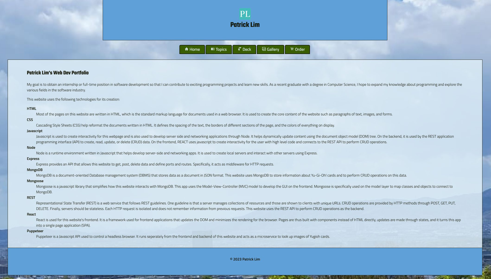

# Portfolio Website

**Technologies Used:** 
* HTML
* CSS
* Javascript
* Node
* Express
* MongoDB
* Mongoose
* REST
* React
* Puppeteer

## **Authors:**
Patrick Lim

## Citation:

**Date:** 03/06/2024
 
The Yugioh image microservice was orginally created by my project partner, Thea Dinh, and was modified by me to be hosted online.

## Project Overview

This website was created using various technologies related to web development and demonstrates my proficiency and knowledge about it. It also includes a separate microservice that uses web scraping (Puppeteer) to lookup
images from the Yugioh card game.

## Project URL:
https://patricks-frontend.onrender.com/
